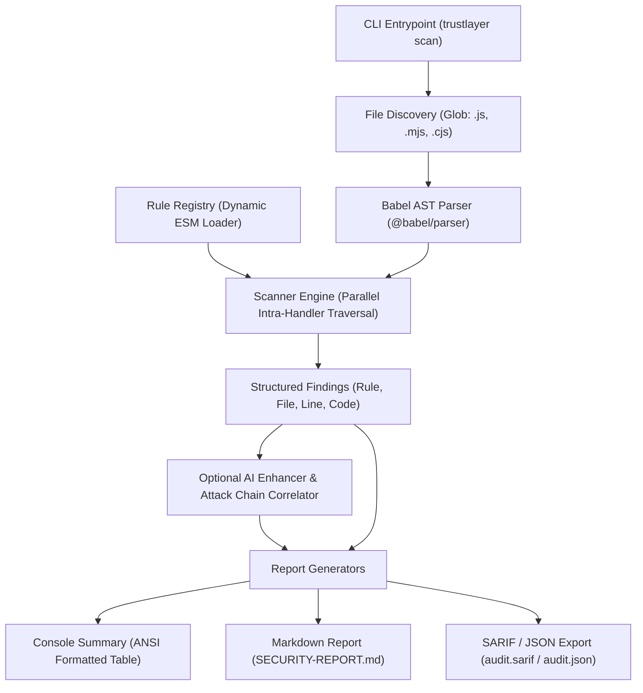

```text
████████╗██████╗ ██╗   ██╗███████╗████████╗██╗      █████╗ ██╗   ██╗███████╗██████╗ 
╚══██╔══╝██╔══██╗██║   ██║██╔════╝╚══██╔══╝██║     ██╔══██╗╚██╗ ██╔╝██╔════╝██╔══██╗
   ██║   ██████╔╝██║   ██║███████╗   ██║   ██║     ███████║ ╚████╔╝ █████╗  ██████╔╝
   ██║   ██╔══██╗██║   ██║╚════██║   ██║   ██║     ██╔══██║  ╚██╔╝  ██╔══╝  ██╔══██╗
   ██║   ██║  ██║╚██████╔╝███████║   ██║   ███████╗██║  ██║   ██║   ███████╗██║  ██║
   ╚═╝   ╚═╝  ╚═╝ ╚═════╝ ╚══════╝   ╚═╝   ╚══════╝╚═╝  ╚═╝   ╚═╝   ╚══════╝╚═╝  ╚═╝
```

# 🛡️ TrustLayer

> **Deterministic, Framework-Aware Static Security Scanner for Node.js & Express APIs**  
> *Built for the Cybersecurity Hackathon — Theme: "Shipped Fast, Left Open"*

[](https://nodejs.org/)
[](https://vitest.dev/)
[](https://developer.mozilla.org/en-US/docs/Web/JavaScript)
[](LICENSE)
[](#️-core-architecture--pipeline)

---

## 📑 Table of Contents

- [📌 Executive Summary](#-executive-summary)
- [✨ Key Capabilities & Differentiators](#-key-capabilities--differentiators)
- [🏗️ Core Architecture & Pipeline](#️-core-architecture--pipeline)
- [🚦 Project Status & Implementation Matrix](#-project-status--implementation-matrix)
- [💻 Quick Start & CLI Usage](#-quick-start--cli-usage)
  - [Prerequisites](#prerequisites)
  - [Installation](#installation)
  - [Running the Scanner](#running-the-scanner)
  - [CLI Flags & Options Reference](#cli-flags--options-reference)
  - [AI Mode Configuration (Online vs. Offline)](#ai-mode-configuration-online-vs-offline)
- [🛡️ Security Rules Portfolio](#️-security-rules-portfolio)
- [🎬 Hackathon Demonstration & Comparison](#-hackathon-demonstration--comparison)
- [🧪 Testing & Test Suite Breakdown](#-testing)
- [📚 Documentation & Audits](#-documentation--audits)
- [📂 Repository Layout](#-repository-layout)
- [📐 Rule Specification Contract](#-rule-specification-contract)
- [👥 Team & Ownership Boundaries](#-team--ownership-boundaries)
- [🔮 Phase 2 Roadmap & Future Horizons](#-phase-2-roadmap--future-horizons)
- [📄 License](#-license)

---

## 📌 Executive Summary

When developers build and deploy e-commerce backends at rapid pace, security checks are frequently left behind. Critical oversights—such as accepting payment amounts directly from client requests, failing to verify webhook cryptographic signatures, omitting authentication middleware on internal endpoints, and concatenating input into database queries—are frequently shipped straight to production.

Existing static analysis tools (Semgrep, ESLint-security, Gitleaks, SonarQube) suffer from two major problems:
1. **Zero Domain Awareness for Payments**: Traditional SAST scanners have no rules for Stripe, Razorpay, or payment transaction tampering.
2. **Framework Ignorance**: Generic tools fail to understand Express middleware chains, leading to high false-positive rates or completely missed authorization flaws.

**TrustLayer** solves this with an ultra-fast, deterministic, intra-handler AST analysis engine tailored specifically for Node.js/Express APIs.

---

## ✨ Key Capabilities & Differentiators

- 💳 **Specialized Payment Security (Primary Differentiator)**  
  Detects client-controlled transaction amounts (`req.body.amount` flowing into Stripe/Razorpay APIs), unverified webhook signatures, and client-side payment status gating before code reaches production.
- ⚡ **Deterministic & Instant Core**  
  Zero dependency on external networks or LLM APIs for vulnerability detection. High-speed AST traversal powered directly by `@babel/parser` and `@babel/traverse` in milliseconds.
- 🌐 **Express Framework Awareness**  
  Tracks Express input sources (`req.body`, `req.params`, `req.query`, `req.headers`) and inspects middleware authorization chains across route definitions.
- 🔌 **Dynamic Rule Auto-Discovery**  
  Rules in `src/rules/*.js` are discovered and registered at runtime via native ES module `import()`. No centralized hardcoded rule registry needed.
- 🤖 **Additive AI Enhancement & Attack Chains**  
  Vulnerability detection is 100% deterministic. Additive offline heuristics correlate independent findings into multi-stage attack chains; optional LLM integration (Gemini 3.8 Flash / OpenAI) crafts real-world exploit walkthroughs and remediation diffs.
- 📊 **Executive & CI/CD Reporting**  
  Generates clean GitHub Flavored Markdown (GFM) executive summaries, structured JSON, and OASIS SARIF v2.1.0 output for direct GitHub Code Scanning integration.
- 🪶 **Pure JavaScript Tooling**  
  Zero native C-bindings or tree-sitter compilation hazards; runs out-of-the-box on Node 20+ anywhere.

---

## 🏗️ Core Architecture & Pipeline



---

## 🚦 Project Status & Implementation Matrix

All 5 core layers and specialized rule categories are **fully implemented, integrated, and verified** with **225/225 tests passing (100% pass rate)**:

| Subsystem / Layer | Component / Files | Status | Test Coverage |
|---|---|:---:|:---:|
| **Data Contracts** | `src/types/rule.js`, `src/types/finding.js`, `src/types/report.js` | 🟢 Completed | 7 / 7 Tests Passing (`finding.test.js`) |
| **AST & Pattern Helpers** | `src/utils/ast-helpers.js`, `src/utils/patterns.js` | 🟢 Completed | 34 / 34 Tests Passing |
| **Babel AST Parser** | `src/engine/ast-parser.js` | 🟢 Completed | 14 / 14 Tests Passing |
| **File Discovery** | `src/engine/file-discovery.js` | 🟢 Completed | 17 / 17 Tests Passing |
| **Rule Auto-Registry** | `src/engine/rule-registry.js` | 🟢 Completed | 7 / 7 Tests Passing |
| **Scanner Orchestrator** | `src/engine/scanner.js` | 🟢 Completed | 18 / 18 Tests Passing |
| **CLI & Programmatic API** | `src/cli.js`, `src/index.js` (Commander.js, exit codes) | 🟢 Completed | 43 / 43 Tests Passing |
| **Payment Security Rules** | `payment-amount-tampering.js`, `missing-webhook-verification.js` | 🟢 Completed | 31 / 31 Tests Passing |
| **Authentication & IDOR Rules** | `missing-auth-middleware.js`, `idor-access-control.js`, `missing-rate-limiting.js` | 🟢 Completed | 35 / 35 Tests Passing |
| **Secrets & Crypto Rules** | `src/rules/hardcoded-secrets.js`, `src/rules/weak-crypto.js` | 🟢 Completed | 35 / 35 Tests Passing |
| **Injection Rules** | `src/rules/sql-injection.js`, `missing-input-validation.js` | 🟢 Completed | 23 / 23 Tests Passing |
| **Reporters & SARIF** | `src/reporters/markdown-reporter.js`, `src/reporters/json-reporter.js` | 🟢 Completed | 21 / 21 Tests Passing |
| **AI & Attack Chains** | `src/ai/enhancer.js` (Offline Heuristics + Gemini / Claude / OpenAI) | 🟢 Completed | 13 / 13 Tests Passing |
| **Vulnerable Demo App** | `demo/server.js`, `demo/routes/*`, `demo/db/*` | 🟢 Completed | 12 Canonical Flaws Detected |
| **Hardened Reference App** | `demo-fixed/*` (Verified Remediation Counterpart) | 🟢 Completed | 100% Clean Scan (0 Flaws) |
| **CI/CD & GitHub Actions** | `.github/workflows/ci.yml`, `security-scan.yml`, `action.yml` | 🟢 Completed | Node 20/22 Matrix + SARIF Upload |
| **Git Pre-commit Hook** | `scripts/pre-commit.sh`, `scripts/install-hooks.js` | 🟢 Completed | Automatic commit staging guard |
| **E2E Demo Verification** | `tests/reporters/demo-verification.test.js` | 🟢 Completed | 19 / 19 Tests Passing |

---

## 💻 Quick Start & CLI Usage

### Prerequisites
- **Node.js**: `20.0.0` or higher
- **npm**: `9.0.0` or higher

### Installation
```bash
# Clone the repository
git clone https://github.com/vikalp1817243/TrustLayer.git
cd TrustLayer

# Install dependencies
npm install
```

### Running the Scanner

TrustLayer features a full-featured CLI powered by Commander.js:

```bash
# 1. Scan current directory (generates terminal table & SECURITY-REPORT.md)
node src/cli.js scan

# 2. Scan a specific project directory
node src/cli.js scan ./demo

# 3. Scan with AI enhancements & correlated multi-stage attack chains
node src/cli.js scan ./demo --ai

# 4. Verbose mode: display code remediation diffs & exploit previews in terminal
node src/cli.js scan ./demo -v

# 5. Export OASIS SARIF v2.1.0 for GitHub Code Scanning / IDE security tabs
node src/cli.js scan ./demo -f sarif -o audit.sarif

# 6. Export structured JSON for custom CI/CD pipelines
node src/cli.js scan ./demo -f json -o audit.json

# 7. Compare vulnerable demo vs hardened reference app side-by-side
npm run demo:compare

# 8. Scan hardened reference application (demonstrates 100% clean scan)
node src/cli.js scan ./demo-fixed

# 9. Terminal summary only (suppress file output)
node src/cli.js scan ./demo --no-report

# 10. Filter findings by minimum severity or specific category
node src/cli.js scan ./demo -s critical
node src/cli.js scan ./demo -c payment
```

### CLI Flags & Options Reference

| Flag / Option | Description | Default |
|---|---|---|
| `[target]` | Target directory or file to scan | `.` (current directory) |
| `-o, --output <file>` | Output report path | `SECURITY-REPORT.md` (or `.json` / `.sarif`) |
| `-f, --format <format>` | Output format: `markdown` (`md`), `json`, or `sarif` | `markdown` |
| `--ai` | Enable additive AI enhancement layer (works offline or online) | `false` |
| `--api-key <key>` | Gemini / LLM API key (can also be set via `GEMINI_API_KEY` in `.env`) | None |
| `-v, --verbose` | Show verbose exploit walk-throughs & remediation diffs in console | `false` |
| `-s, --severity <level>` | Minimum severity filter: `critical`, `high`, `medium`, `low` | `low` |
| `-c, --category <cat>` | Filter by category: `payment`, `auth`, `injection`, `secrets` | All |
| `--fail-on <severity>` | Fail with exit code 1 if findings meet threshold (`critical`, `high`, etc.) | `high` |
| `--no-report` | Suppress disk report generation (terminal output only) | `false` |
| `--ignore <glob>` | Custom glob ignore pattern (e.g., `**/fixtures/**`) | Built-in ignores |
| `--rules <dir>` | Load additional custom rules from a directory | None |

### AI Mode Configuration (Online vs. Offline)

TrustLayer operates with a **Deterministic Detection Core**:
- **Offline Heuristics (Default)**: Automatically correlates 4 multi-stage attack chains (e.g., Unauthenticated Orders → Client-Controlled Amount Tampering) and provides deterministic code fixes with **zero network requests and zero LLM dependencies**.
- **Multi-Provider Cloud AI (Auto-Fallback Cascades)**: When an API key is configured, TrustLayer enriches findings with tailored business impact assessments, realistic exploit walk-throughs, and contextual code remediation diffs:
  - **Google Gemini (Default)**: Automatically attempts high-availability fast models with seamless fallback:  
    `gemini-3.5-flash` → `gemini-3.5-flash-lite` → `gemini-3.6-flash` → `gemini-3.7-flash` → `gemini-3.8-flash` → `gemini-3.1-flash-lite`.
  - **Anthropic Claude**: Automatically supported with model failover:  
    `claude-3-7-sonnet-latest` → `claude-3-5-sonnet-latest` → `claude-3-5-haiku-latest`.
  - **OpenAI**: Supported with `gpt-4o-mini`.

  ```bash
  # Option A: Set in .env file or environment (Recommended)
  # For Google Gemini:
  export GEMINI_API_KEY="AIzaSy..."   # (or GOOGLE_API_KEY)

  # For Anthropic Claude:
  export ANTHROPIC_API_KEY="sk-ant-..." # (or CLAUDE_API_KEY)

  # Run scan with AI enabled:
  node src/cli.js scan ./demo --ai

  # Option B: Pass via CLI flag
  node src/cli.js scan ./demo --ai --api-key "your-api-key"
  ```

---

## 🛡️ Security Rules Portfolio

TrustLayer ships with 9 deterministic AST rules engineered specifically for Node.js/Express e-commerce architectures:

| Rule ID | Category | Severity | Detection Trigger & Mechanism |
|---|---|:---:|---|
| [`payment/payment-amount-tampering`](file:///home/jay/Documents/TrustLayer/src/rules/payment-amount-tampering.js) | `payment` | **Critical** | Traces client input (`req.body.amount`, `req.body.price`) flowing directly into payment SDK calls (`stripe.charges.create`, `stripe.paymentIntents.create`, `razorpay.orders.create`) without server-side catalog price lookup. |
| [`payment/missing-webhook-verification`](file:///home/jay/Documents/TrustLayer/src/rules/missing-webhook-verification.js) | `payment` | **High** | Flags payment webhook handlers (`/webhook`, `/stripe-webhook`) that lack cryptographic HMAC signature verification (`stripe.webhooks.constructEvent` or `crypto.timingSafeEqual`). |
| [`auth/missing-auth-middleware`](file:///home/jay/Documents/TrustLayer/src/rules/missing-auth-middleware.js) | `auth` | **High** | Inspects Express routing chains on sensitive routes (`/api/orders`, `/api/admin`, `/api/users`) to detect endpoints omitting authentication middleware guards. |
| [`auth/idor-access-control`](file:///home/jay/Documents/TrustLayer/src/rules/idor-access-control.js) | `auth` | **High** | Flags database operations querying resources by ID parameter (`req.params.id`) without verifying ownership or scoping queries to the authenticated user ID (`user_id = req.user.id`). |
| [`auth/missing-rate-limiting`](file:///home/jay/Documents/TrustLayer/src/rules/missing-rate-limiting.js) | `auth` | **Medium** | Identifies brute-force and financial abuse-prone routes (`/login`, `/register`, `/checkout`, `/forgot-password`) omitting rate-limiting middleware (`express-rate-limit`, `rateLimiter`). |
| [`secrets/hardcoded-secrets`](file:///home/jay/Documents/TrustLayer/src/rules/hardcoded-secrets.js) | `secrets` | **Critical** | Scans variable declarations and object configs for live API keys (Stripe `sk_live_`, Razorpay `rzp_live_`, AWS `AKIA...`, JWT secrets) using exact prefix matching and Shannon entropy analysis. |
| [`secrets/weak-crypto`](file:///home/jay/Documents/TrustLayer/src/rules/weak-crypto.js) | `secrets` | **High** | Flags obsolete cryptographic hashing (`md5`, `sha1`), weak legacy ciphers (`des`, `rc4`), and `Math.random()` used in security-sensitive token/session generation contexts. |
| [`injection/sql-injection`](file:///home/jay/Documents/TrustLayer/src/rules/sql-injection.js) | `injection` | **Critical** | Detects unparameterized SQL queries built via template literals or string concatenation flowing directly into database sinks (`db.query`, `db.run`, `pool.query`, `knex.raw`). |
| [`injection/missing-input-validation`](file:///home/jay/Documents/TrustLayer/src/rules/missing-input-validation.js) | `injection` | **High** | Flags route handlers accepting client parameters without presence checks, schema validation (`express-validator`, `zod`, `joi`), or type guards. |

---

## 🎬 Hackathon Demonstration & Comparison

To demonstrate TrustLayer's speed, precision, and zero-false-positive design during presentations, run the automated comparison script:

```bash
npm run demo:compare
```

### What the Comparison Proves:
1. **Vulnerable Application (`demo/`)**:
   - TrustLayer analyzes 8 files in **<15ms**.
   - Discovers **8 canonical vulnerabilities** across payment, auth, injection, and secret domains.
   - Correlates compound attack chains (e.g., Unauthenticated Orders + Client-Controlled Price Tampering).
   - Blocks the deployment gate (**exit code 1**).
2. **Hardened Reference Application (`demo-fixed/`)**:
   - Re-scans the remediated codebase.
   - Produces **0 findings** and **100% clean scan badge**.
   - Allows CI/CD deployment (**exit code 0**).

---

## 🧪 Testing

The repository uses **Vitest** for fast unit and integration testing.

```bash
# Run all 317 tests across all 22 test suites
npm test

# Run tests in watch mode during development
npm run test:watch
```

Current test status: **317 passing tests (100%)** across 22 test files:
- **Core Engine & CLI (99 tests)**:
  - `tests/cli.test.js` (34 tests)
  - `tests/engine/scanner.test.js` (18 tests)
  - `tests/engine/file-discovery.test.js` (17 tests)
  - `tests/engine/ast-parser.test.js` (14 tests)
  - `tests/engine/index.test.js` (9 tests)
  - `tests/engine/rule-registry.test.js` (7 tests)
- **AST Utilities & Contracts (41 tests)**:
  - `tests/utils/ast-helpers.test.js` (24 tests)
  - `tests/utils/patterns.test.js` (10 tests)
  - `tests/engine/finding.test.js` (7 tests)
- **Security Rules (124 tests)**:
  - `tests/rules/payment-amount-tampering.test.js` (22 tests)
  - `tests/rules/weak-crypto.test.js` (19 tests)
  - `tests/rules/hardcoded-secrets.test.js` (16 tests)
  - `tests/rules/sql-injection.test.js` (16 tests)
  - `tests/rules/missing-auth-middleware.test.js` (15 tests)
  - `tests/rules/idor-access-control.test.js` (10 tests)
  - `tests/rules/missing-rate-limiting.test.js` (10 tests)
  - `tests/rules/missing-webhook-verification.test.js` (9 tests)
  - `tests/rules/missing-input-validation.test.js` (7 tests)
- **Reporters, AI & E2E Verification (53 tests)**:
  - `tests/reporters/demo-verification.test.js` (19 tests)
  - `tests/reporters/enhancer.test.js` (13 tests)
  - `tests/reporters/json-reporter.test.js` (12 tests)
  - `tests/reporters/markdown-reporter.test.js` (9 tests)

---

## 🚀 GitHub Actions CI/CD & Developer Workflows

TrustLayer includes production-ready automated workflows and git integrations:

### 1. Continuous Integration Matrix ([`.github/workflows/ci.yml`](.github/workflows/ci.yml))
Automatically runs on pull requests and pushes to `main`:
- Tests across Node.js **20.x** and **22.x** runners.
- Executes full test suite (`npm test`).
- Enforces regression gates on the hardened reference app (`npm run scan:fixed`).
- Validates scanner throughput benchmarks (`npm run benchmark`).

### 2. Native GitHub Code Scanning via SARIF ([`.github/workflows/security-scan.yml`](.github/workflows/security-scan.yml))
Generates OASIS SARIF v2.1.0 output and uploads it via `@github/codeql-action/upload-sarif`:
- Annotates pull request diffs directly with line-by-line security alerts.
- Feeds findings into repository **Security ➔ Code scanning alerts** tab.

### 3. Reusable GitHub Action ([`action.yml`](action.yml))
Drop TrustLayer into any repository with zero configuration:
```yaml
- name: Run TrustLayer Security Scan
  uses: vikalp1817243/TrustLayer@v1
  with:
    target: '.'
    fail-on: 'high'
    format: 'sarif'
```

### 4. Automated Git Pre-Commit Hook
Prevent committing vulnerable code before it ever hits git history:
```bash
# Install the hook with a single command
npm run hooks:install
```
The hook automatically intercepts `git commit`, inspects staged JS/TS files, and aborts commits if High or Critical vulnerabilities are introduced.

---

## 📚 Documentation & Audits

- 📑 [**Comprehensive Team Audit Report**](docs/audit-report.md) — Detailed technical audit of all 5 members' codebases, test coverage gaps, edge-case analysis, implementation plans, and demo day priorities.
- 🤖 [**AI Agent Directives (AGENTS.md)**](AGENTS.md) — Mandatory architecture rules, non-overlapping file ownership boundaries, and coding standards for AI assistants.
- 👥 [**Team Roles & Ownership (ROLES.md)**](ROLES.md) — Developer responsibility matrix, branch workflows, and merge order.
- 🤝 [**Contributing Guidelines (CONTRIBUTING.md)**](CONTRIBUTING.md) — Contribution protocols, rule interfaces, and pull request checklist.

---

## 📂 Repository Layout

```
TrustLayer/
├── .github/                    # CI/CD and security automation
│   └── workflows/
│       ├── ci.yml              # Node 20/22 multi-runner test & benchmark gate
│       └── security-scan.yml   # SARIF generation & GitHub Security tab upload
├── docs/                       # Project documentation & team audits
│   ├── audit-report.md         # Comprehensive 5-member codebase audit & Phase 2 roadmap
│   └── benchmark-results.md    # Throughput and latency benchmarking report
├── scripts/                    # Utilities and automated git hooks
│   ├── benchmark.js            # Performance benchmark harness
│   ├── demo-compare.js         # Side-by-side vulnerable vs hardened demo comparator
│   ├── pre-commit.sh           # Git pre-commit security gate
│   └── install-hooks.js        # Git pre-commit installer
├── src/
│   ├── cli.js                  # CLI entrypoint (Commander.js, formatting & exit codes)
│   ├── index.js                # Programmatic JavaScript API entrypoint
│   ├── types/                  # Core data contracts & JSDoc specifications
│   │   ├── rule.js             # Rule and AnalysisContext interfaces
│   │   ├── finding.js          # Finding structure and schema validation
│   │   └── report.js           # ScanReport schema & severity calculators
│   ├── engine/                 # Deterministic scanning engine
│   │   ├── scanner.js          # Orchestrator (scans files, applies rule fallbacks)
│   │   ├── ast-parser.js       # Pure Babel AST parser with error recovery
│   │   ├── file-discovery.js   # Fast glob discovery with default ignore patterns
│   │   └── rule-registry.js    # Dynamic ESM auto-discovery loader
│   ├── rules/                  # Modular security rules (one file per rule)
│   │   ├── payment-amount-tampering.js
│   │   ├── missing-webhook-verification.js
│   │   ├── missing-auth-middleware.js
│   │   ├── idor-access-control.js
│   │   ├── missing-rate-limiting.js
│   │   ├── hardcoded-secrets.js
│   │   ├── weak-crypto.js
│   │   ├── sql-injection.js
│   │   └── missing-input-validation.js
│   ├── utils/                  # Shared AST traversal and regex pattern libraries
│   │   ├── ast-helpers.js      # isMethodCall, isReqAccess, entropy calculations
│   │   └── patterns.js         # Secret regex definitions & SQL sinks
│   ├── reporters/              # Report generation formats
│   │   ├── markdown-reporter.js# GFM executive report with clean-scan banner
│   │   └── json-reporter.js    # JSON & OASIS SARIF v2.1.0 generator
│   └── ai/                     # Additive AI enhancement
│       └── enhancer.js         # Heuristic attack chains & multi-LLM enrichment
├── demo/                       # Deliberately vulnerable reference Express app
│   ├── server.js               # Express application with route auto-mounting
│   ├── db/setup.js             # SQLite initialization with realistic seeds
│   ├── middleware/auth.js      # Middleware stubs
│   └── routes/                 # 12 canonical vulnerable endpoints (auth, products, checkout, webhook, orders)
├── demo-fixed/                 # Hardened reference app demonstrating verified fixes (0 findings)
│   ├── middleware/             # Hardened auth and rate-limiting middleware
│   └── routes/                 # Hardened, validated, scoped endpoints
├── tests/                      # Automated Vitest test suites (317 tests across 22 suites)
│   ├── cli.test.js             # CLI argument, exit-code & format validation (34 tests)
│   ├── engine/                 # Scanner, parser, discovery, registry, finding, index (82 tests)
│   ├── utils/                  # AST helpers & patterns unit tests (34 tests)
│   ├── rules/                  # 9 Security rule test suites (124 tests)
│   └── reporters/              # Markdown, JSON/SARIF, AI enhancer, demo-verification (53 tests)
├── action.yml                  # Reusable composite GitHub Action
├── AGENTS.md                   # Global directives for AI assistants
├── ROLES.md                    # Team member role boundaries & ownership guide
├── CONTRIBUTING.md             # Branching protocol and PR guidelines
└── package.json
```

---

## 📐 Rule Specification Contract

Every security rule in `src/rules/*.js` must implement and export the `Rule` interface:

```javascript
/**
 * @typedef {import('../types/rule.js').Rule} Rule
 */

/** @type {Rule} */
const exampleRule = {
  id: 'category/kebab-case-name',
  name: 'Human Readable Title',
  severity: 'critical',           // 'critical' | 'high' | 'medium' | 'low'
  category: 'payment',            // 'payment' | 'auth' | 'injection' | 'secrets'
  description: 'Concise summary of the vulnerability pattern.',
  defaultExplanation: 'In-depth explanation used when AI is offline.',
  defaultRemediation: 'Secure code snippet demonstrating the fix.',
  
  analyze(context) {
    const findings = [];
    const { filePath, fileContent, ast, lines } = context;

    if (!ast) return findings;

    // Use @babel/traverse on the pre-parsed AST
    // Never parse the file manually inside analyze()

    return findings;
  }
};

export default exampleRule;
```

---

## 👥 Team & Ownership Boundaries

To enable parallel development without merge conflicts, team members worked in isolated branches:

| Member | Focus Area | Branch | Status | Owned Files |
|---|---|---|:---:|---|
| **Member 1 (Lead)** | Core Engine, CLI, Types, Utils, Tests, Demo Skeleton | `main` | 🟢 Merged | `src/engine/*`, `src/cli.js`, `src/types/*`, `src/utils/*`, `demo/server.js`, `demo/db/*` |
| **Member 2** | Secrets & Weak Cryptography | `feature/secrets-crypto` | 🟢 Merged | `src/rules/hardcoded-secrets.js`, `src/rules/weak-crypto.js`, tests |
| **Member 3** | SQL Injection & Validation Flaws | `feature/injection-rules` | 🟢 Merged | `src/rules/sql-injection.js`, `src/rules/missing-input-validation.js`, tests |
| **Member 4** | Payment Tampering & Auth Gaps | `feature/auth-payment-rules` | 🟢 Merged | `src/rules/payment-*.js`, `src/rules/missing-webhook-*.js`, `missing-auth-*.js`, tests |
| **Member 5** | Reporters, AI Enhancer, Demo Routes & Fixed App | `feature/demo-reporting` | 🟢 Merged | `src/reporters/*`, `src/ai/*`, `demo/routes/*`, `demo-fixed/*`, tests |

For detailed development guidelines, refer to [ROLES.md](ROLES.md) and [AGENTS.md](AGENTS.md).

---

## 🔮 Phase 2 Roadmap & Future Horizons

> [!NOTE]
> All core hackathon deliverables (Phases 0 & 1) are complete with 225/225 tests passing. The items below outline the Phase 2 expansion roadmap:

1. **Programmatic Library Export (`src/index.js`)**  
   Export `scan`, `discoverFiles`, `parseSource`, and reporters directly for programmatic Node.js API and CI script consumption without spawning subprocesses.
2. **NPM Distribution & Global CLI**  
   Publish to npm registry (`npx trustlayer scan`) with global cross-platform packaging.
3. **Repository Config File (`.trustlayerrc.json`)**  
   Support custom organization rules, team-specific severity threshold overrides, and ignored patterns.
4. **Extended Rule Sets**  
   Expand rules for NoSQL injection, JWT `algorithm: 'none'` bypasses, and insecure HTTP payment callback URLs.

---

## 📄 License

This project is licensed under the [ISC License](LICENSE).