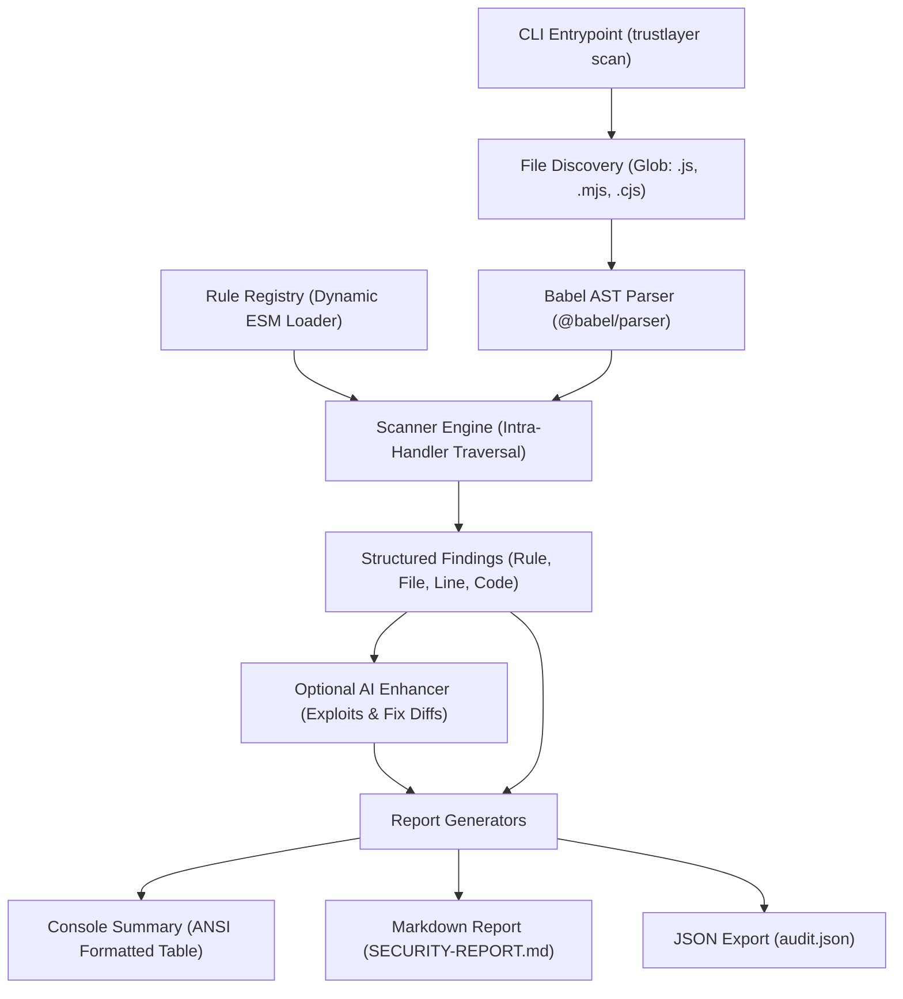

# 🛡️ TrustLayer

> **Deterministic, Framework-Aware Static Security Scanner for Node.js & Express APIs**  
> *Built for the Cybersecurity Hackathon — Theme: "Shipped Fast, Left Open"*

[](https://nodejs.org/)
[](https://vitest.dev/)
[](https://developer.mozilla.org/en-US/docs/Web/JavaScript)
[](LICENSE)
[](#core-architecture)

---

## 📌 Executive Summary

When developers build and deploy e-commerce backends at rapid pace, security checks are frequently left behind. Critical oversights—such as accepting payment amounts directly from client requests, failing to verify webhook cryptographic signatures, omitting authentication middleware on internal endpoints, and concatenating input into database queries—are frequently shipped straight to production.

Existing static analysis tools (Semgrep, ESLint-security, Gitleaks, SonarQube) suffer from two major problems:
1. **Zero Domain Awareness for Payments**: Traditional SAST scanners have no rules for Stripe, Razorpay, or payment transaction tampering.
2. **Framework Ignorance**: Generic tools fail to understand Express middleware chains, leading to high false-positive rates or completely missed authorization flaws.

**TrustLayer** solves this with an ultra-fast, deterministic, intra-handler AST analysis engine tailored specifically for Node.js/Express APIs.

---

## ✨ Key Capabilities & Differentiators

- 💳 **Specialized Payment Security (Primary Differentiator)**  
  Detects client-controlled transaction amounts (`req.body.amount` flowing into Stripe/Razorpay APIs), unverified webhook signatures, and client-side payment status gating before code reaches production.
- ⚡ **Deterministic & Instant Core**  
  Zero dependency on external networks or LLM APIs for vulnerability detection. High-speed AST traversal powered directly by `@babel/parser` and `@babel/traverse` in milliseconds.
- 🌐 **Express Framework Awareness**  
  Tracks Express input sources (`req.body`, `req.params`, `req.query`, `req.headers`) and inspects middleware authorization chains across route definitions.
- 🔌 **Dynamic Rule Auto-Discovery**  
  Rules in `src/rules/*.js` are discovered and registered at runtime via native ES module `import()`. No centralized hardcoded rule registry needed.
- 🤖 **Additive AI Enhancement (Optional)**  
  Vulnerability detection is 100% deterministic. AI is strictly additive: generating real-world exploit walkthroughs, estimating business impact, and crafting remediation code diffs.
- 🪶 **Pure JavaScript Tooling**  
  Zero native C-bindings or tree-sitter compilation hazards; runs out-of-the-box on Node 20+ anywhere.

---

## 🏗️ Core Architecture & Pipeline



---

## 🚦 Project Status & Implementation Matrix

The core scanner engine, CLI, shared utilities, data contracts, and demo application skeleton are completed and merged into `main`. Security rules and reporting modules are currently being integrated across specialized feature branches:

| Subsystem / Layer | Component / Files | Status | Test Coverage |
|---|---|:---:|:---:|
| **Data Contracts** | `src/types/rule.js`, `src/types/finding.js`, `src/types/report.js` | 🟢 Completed | JSDoc Validated |
| **AST & Pattern Helpers** | `src/utils/ast-helpers.js`, `src/utils/patterns.js` | 🟢 Completed | 21 / 21 Tests Passing |
| **Babel AST Parser** | `src/engine/ast-parser.js` | 🟢 Completed | 9 / 9 Tests Passing |
| **File Discovery** | `src/engine/file-discovery.js` | 🟢 Completed | 8 / 8 Tests Passing |
| **Rule Auto-Registry** | `src/engine/rule-registry.js` | 🟢 Completed | 5 / 5 Tests Passing |
| **Scanner Orchestrator** | `src/engine/scanner.js` | 🟢 Completed | 7 / 7 Tests Passing |
| **CLI Interface** | `src/cli.js` (Commander.js, ANSI Banner, exit codes) | 🟢 Completed | Verified E2E |
| **Demo Application** | `demo/server.js`, `demo/db/setup.js` (Express + SQLite) | 🟢 Completed | Verified E2E |
| **Payment & Auth Rules** | `src/rules/payment-*.js`, `src/rules/missing-auth-*.js` | 🟡 `feature/auth-payment-rules` | In Progress |
| **Secrets & Crypto Rules** | `src/rules/hardcoded-secrets.js`, `src/rules/weak-crypto.js` | 🟡 `feature/secrets-crypto` | In Progress |
| **Injection Rules** | `src/rules/sql-injection.js`, `missing-input-validation.js` | 🟡 `feature/injection-rules` | In Progress |
| **Reporting & AI** | `src/reporters/*`, `src/ai/*`, `demo/routes/*` | 🟡 `feature/demo-reporting` | In Progress |

---

## 💻 Quick Start & CLI Usage

### Prerequisites
- **Node.js**: `20.0.0` or higher
- **npm**: `9.0.0` or higher

### Installation
```bash
# Clone the repository
git clone https://github.com/vikalp1817243/TrustLayer.git
cd TrustLayer

# Install dependencies
npm install
```

### Running the Scanner

TrustLayer features a full-featured CLI powered by Commander.js:

```text
████████╗██████╗ ██╗   ██╗███████╗████████╗██╗      █████╗ ██╗   ██╗███████╗██████╗ 
╚══██╔══╝██╔══██╗██║   ██║██╔════╝╚══██╔══╝██║     ██╔══██╗╚██╗ ██╔╝██╔════╝██╔══██╗
   ██║   ██████╔╝██║   ██║███████╗   ██║   ██║     ███████║ ╚████╔╝ █████╗  ██████╔╝
   ██║   ██╔══██╗██║   ██║╚════██║   ██║   ██║     ██╔══██║  ╚██╔╝  ██╔══╝  ██╔══██╗
   ██║   ██║  ██║╚██████╔╝███████║   ██║   ███████╗██║  ██║   ██║   ███████╗██║  ██║
   ╚═╝   ╚═╝  ╚═╝ ╚═════╝ ╚══════╝   ╚═╝   ╚══════╝╚═╝  ╚═╝   ╚═╝   ╚══════╝╚═╝  ╚═╝

 🔍 TrustLayer Static Security Scanner v1.0.0
    Deterministic AST & Data-Flow Analysis for Node.js/Express
```

```bash
# 1. Scan current directory (generates terminal table & SECURITY-REPORT.md)
node src/cli.js scan

# 2. Scan a specific project directory
node src/cli.js scan ./demo

# 3. Scan a single file
node src/cli.js scan ./demo/server.js

# 4. Save report with custom name / Markdown format
node src/cli.js scan ./demo -o audit-summary

# 5. Export structured JSON report for CI/CD pipelines
node src/cli.js scan ./demo -o audit -f json

# 6. Terminal summary only (suppress file output)
node src/cli.js scan ./demo --no-report

# 7. Exclude custom directories from scan
node src/cli.js scan ./demo --ignore "**/fixtures/**"
```

---

## 🧪 Testing

The repository uses **Vitest** for fast unit and integration testing.

```bash
# Run all passing engine & utility test suites
npx vitest run tests/engine/ tests/utils/

# Run with test watcher during development
npm run test:watch
```

Current test status: **50 passing tests** across:
- `tests/utils/ast-helpers.test.js` (21 tests)
- `tests/engine/ast-parser.test.js` (9 tests)
- `tests/engine/file-discovery.test.js` (8 tests)
- `tests/engine/rule-registry.test.js` (5 tests)
- `tests/engine/scanner.test.js` (7 tests)

---

## 📂 Repository Layout

```
TrustLayer/
├── src/
│   ├── cli.js                  # CLI entrypoint (Commander.js, formatting & exit codes)
│   ├── types/                  # Core data contracts & JSDoc specifications
│   │   ├── rule.js             # Rule and AnalysisContext interfaces
│   │   ├── finding.js          # Finding structure and schema validation
│   │   └── report.js           # ScanReport schema & severity calculators
│   ├── engine/                 # Deterministic scanning engine
│   │   ├── scanner.js          # Orchestrator (scans files, applies rule fallbacks)
│   │   ├── ast-parser.js       # Pure Babel AST parser with error recovery
│   │   ├── file-discovery.js   # Fast glob discovery with default ignore patterns
│   │   └── rule-registry.js    # Dynamic ESM auto-discovery loader
│   ├── rules/                  # Modular security rules (one file per rule)
│   │   ├── payment-amount-tampering.js
│   │   ├── missing-webhook-verification.js
│   │   ├── missing-auth-middleware.js
│   │   ├── hardcoded-secrets.js
│   │   ├── weak-crypto.js
│   │   ├── sql-injection.js
│   │   └── missing-input-validation.js
│   ├── utils/                  # Shared AST traversal and regex pattern libraries
│   │   ├── ast-helpers.js      # isMethodCall, isReqAccess, entropy calculations
│   │   └── patterns.js         # Secret regex definitions & SQL sinks
│   ├── reporters/              # Report generation formats
│   │   ├── markdown-reporter.js
│   │   └── json-reporter.js
│   └── ai/                     # Additive AI enhancement
│       └── enhancer.js         # Optional exploit & remediation prompt enrichment
├── demo/                       # Deliberately vulnerable reference Express app
│   ├── server.js               # Express application with route auto-mounting
│   ├── db/setup.js             # SQLite initialization with realistic seeds
│   └── routes/                 # Vulnerable API endpoints (auth, products, checkout, webhook)
├── demo-fixed/                 # Hardened reference app demonstrating verified fixes
├── tests/                      # Automated Vitest test suites
│   ├── engine/                 # Unit tests for core engine modules (29 tests)
│   ├── utils/                  # Unit tests for AST helpers & patterns (21 tests)
│   └── rules/                  # Rule-specific true positive/negative unit tests
├── AGENTS.md                   # Global directives for AI assistants
├── ROLES.md                    # Team member role boundaries & ownership guide
├── CONTRIBUTING.md             # Branching protocol and PR guidelines
└── package.json
```

---

## 📐 Rule Specification Contract

Every security rule in `src/rules/*.js` must implement and export the `Rule` interface:

```javascript
/**
 * @typedef {import('../types/rule.js').Rule} Rule
 */

/** @type {Rule} */
const exampleRule = {
  id: 'category/kebab-case-name',
  name: 'Human Readable Title',
  severity: 'critical',           // 'critical' | 'high' | 'medium' | 'low'
  category: 'payment',            // 'payment' | 'auth' | 'injection' | 'secrets'
  description: 'Concise summary of the vulnerability pattern.',
  defaultExplanation: 'In-depth explanation used when AI is offline.',
  defaultRemediation: 'Secure code snippet demonstrating the fix.',
  
  analyze(context) {
    const findings = [];
    const { filePath, fileContent, ast, lines } = context;

    if (!ast) return findings;

    // Use @babel/traverse on the pre-parsed AST
    // Never parse the file manually inside analyze()

    return findings;
  }
};

export default exampleRule;
```

---

## 👥 Team & Ownership Boundaries

To enable parallel development without merge conflicts, team members work in isolated branches:

| Member | Focus Area | Branch | Owned Files |
|---|---|---|---|
| **Member 1 (Lead)** | Core Engine, CLI, Types, Utils, Tests, Demo Skeleton | `main` | `src/engine/*`, `src/cli.js`, `src/types/*`, `src/utils/*`, `demo/server.js`, `demo/db/*` |
| **Member 2** | Secrets & Weak Cryptography | `feature/secrets-crypto` | `src/rules/hardcoded-secrets.js`, `src/rules/weak-crypto.js`, tests |
| **Member 3** | SQL Injection & Validation Flaws | `feature/injection-rules` | `src/rules/sql-injection.js`, `src/rules/missing-input-validation.js`, tests |
| **Member 4** | Payment Tampering & Auth Gaps | `feature/auth-payment-rules` | `src/rules/payment-*.js`, `src/rules/missing-webhook-*.js`, `missing-auth-*.js`, tests |
| **Member 5** | Reporters, AI Enhancer, Demo Routes | `feature/demo-reporting` | `src/reporters/*`, `src/ai/*`, `demo/routes/*`, `demo-fixed/*` |

For detailed development guidelines, refer to [ROLES.md](ROLES.md) and [AGENTS.md](AGENTS.md).

---

## 📄 License

This project is licensed under the [ISC License](LICENSE).